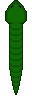
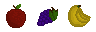
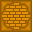

# 🐍 Snako - 2D Game

## About the Project 📖
_Snako_ is inspired by the unforgotten game _Snake_. It follows the same mechanics as the original version. Just more colourful and weird! 🌈

## Game Dynamics 🎲
Just like the original game, the objective is to survive as long as possible without colliding with walls or the snake's own body.

The map is a 25x25 units which can all be setup to contain either a wall or Food. The game starts with the snake being long 3 units.

<div align="center">
    
</div>

Every time a fruit is eaten the number of sections increases and so does the player's score. However, if the snake collides with any of the walls or itself the game ends and the final score is shown in a new background.

<div align="center">
    
    
</div>

## Built with ⌨️
+ HTML/CSS
+ JavaScript

## Start Playing 🎮
Download the repository or clone it:

Open the `index.html` file with any browser and start playing! Preferably, use one of the following ones:
+ Google Chrome
+ Mozilla Firefox
+ Microsoft Edge
+ Safari
+ Opera
+ Brave
+ Internet Explorer 11 and later versions

Other applications might work - Bugs should be expected.

## Program and Execute Project 🗔
No compiler is necessary as the game runs on Browsers. JavaScript knowledge is required to modify the program. Just clone the repository in your local machine and start programming:

```
git clone https://github.com/ErTucci674/snako.git
```

## Files and Code 📄

### Global Constants 🌐
Many of the constant variables need to be accessed by different files. Hence, all of the shared constant variables are declared and assigned in the file globals.js.

### Game Page 🏠
As the game is based and managed by a Browser, the main 'access' file is the `index.html` file. The graphics and rendering is shown in the `<canvas>` element. Everything is managed the JavaScript files called in at the top of the `index.html` file.

```html
<link rel="stylesheet" href="style.css">
<script src="globals.js"></script>
<script src="vector.js"></script>
<script src="button.js"></script>
<script src="quad.js"></script>
<script src="food.js"></script>
<script src="section.js"></script>
<script src="snake.js"></script>
<script src="gameover.js"></script>
<script src="game.js"></script>
<script src="main.js"></script>
```

### Main file ⚡
The `main.js` file is were the whole game performance, dynamics and rendering is managed through the use of other files. 

When the page fully loads, the `<canvas>` element in the `index.html` file is accessed and the graphic interface is setup by one of the _Objects_, `game`.

Whenever the game ends, the page illustrated on `<canvas>` changes to `gameover`. This is controlled by the `currentPage` variable.

```js
window.onload = function () {
    let canvas = document.getElementById("canvas"),
        context = canvas.getContext("2d");

    // Text
    context.font = FONT;

    const game = Game.newGame(canvas, context);
    const gameover = Gameover.newGameover(canvas, context);
    let currentPage = game;
    ...
}
```

All the _events_ (user's input) are taken care in this file and the values are shared across the _Objects/Functions_ that make use of them.

Each _object_ has two main functions in common: `render()` and `update()`. These are called in equivalent functions in the `main.js` file and looped in a constant time change stored in the `timePassed` variable. The time check makes sure that no matter the refresh rate of the user's monitor, the game speed is always going to be the same. The "rendering/animation" is requested to the browser by the function `requestAnimationFrame()`.

```js
function main() {
    // Control Frame Rate
    const timeNow = performance.now();
    const timePassed = timeNow - timeLast;

    if (timePassed >= rr) {
        render();
        update();
        timeLast = timeNow - (timePassed % rr);
    }

    requestAnimationFrame(main);
}
```

The `render()` and `update()` functions run the code depending on the `currentPage` value.

### Game Control 🎮
#### Setup Canvas 🖽
The `game` _objects_ takes care of the graphics and user's interactions. At the declaration, the `<canvas>` is setup to take the current window's size, and the game settings are initiated (map, score, snake, etc.).

```js
setup: function () {
    // Window Size
    this.width = this.canvas.width = window.innerWidth;
    this.widthCenter = this.width * 0.5;
    this.height = this.canvas.height = window.innerHeight;
    this.heightCenter = this.height * 0.5;

    // Map
    this.setGrid();
    this.rectStartX = this.widthCenter - rectHalfSide;
    this.rectStartY = this.heightCenter - rectHalfSide;
    this.map.src = "pictures/map.png";
    this.wall.src = "pictures/wall.png";

    // Snake
    this.setupSnake();

    // Food
    this.setupFood();

    // Text
    this.context.font = FONT;
}
```

The main element is the `this.canvas` variable which stores and changes the attributes of the `<canvas>` element. This is used to take control of the "drawing frame", distances and sizes of everything in the game.

#### Setup Map 🗺️
The map is just 'png' file and on top of it walls and food is placed. The map is divided into 25x25 units stored in a 2D-array of corresponding dimensions, `grid`. The value stored in each element of the array affects the what is going to be placed on that section of the map. The equivalent values can be found in the `globals.js` file.

In the `setGrid()` function the `grid` array is manually set to include walls in the desired shape. The 'manual-change' decision has been taken at last since security issues have been met during the game development. The first idea was to prepare a picture of the same dimensions of the map where the wall would be drawn as black squared while keeping the rest of the backgorund white. The picture would have then been analysed and used as reference to change the values in the `grid` array. The `getImageData().data` should have been the main tool to be used. However, browsers kept coming back with an error that the function was trying to read an external source, which apparently goes against security safety...

In the `maps.txt` file there are two grid's values can be copied and pasted in the `grid`'s values assignment.

#### Quads 🧩
Some of the pictures/frames have been drawn on the same 'png' file. This avoids extra memory usage. `<canvas>` does not include any _quad_ declaring function. However, with the simple `drawImage()` function, specific sections of a picture can be taken and rendered.

The values needed to display the correct section of the pictures are stored as `quad` _objects_.

```js
let Quad = {
    x: 0,
    y: 0,
    width: 0,
    height: 0,

    newQuad: function (x, y, width, height) {
        let obj = Object.create(this);
        obj.x = x;
        obj.y = y;
        obj.width = width;
        obj.height = height;
        return obj;
    },
}
```

#### Rendering 🖼️
The `renderGrid()` function in the `game` file goes through the `grid` array by using _for loops_ and checks what needs to be rendered on part of the map.

```js
renderGrid: function () {
    this.context.fillStyle = "#FFF";
    //Draw Background
    this.context.drawImage(this.map, this.widthCenter - rectHalfSide, this.heightCenter - rectHalfSide, rectSide, rectSide);
    // Draw items
    for (let c = 0; c < gridCols; c++) {
        for (let r = 0; r < gridRows; r++) {
            if (this.grid[r][c] == FOOD) {
                let quad = this.foodQuads[this.currentFood];
                this.context.drawImage(this.food, quad.x, quad.y, quad.width, quad.height,
                    this.widthCenter - rectHalfSide + cellWidth * c,
                    this.heightCenter - rectHalfSide + cellHeight * r,
                    quad.width, quad.height);
            }
            else if (this.grid[r][c] == WALL) {
                this.context.drawImage(this.wall, this.widthCenter - rectHalfSide + cellWidth * c, this.heightCenter - rectHalfSide + cellWidth * r);
            }
        }
    }
    this.context.stroke();
}
```

#### Snake 🐍
The snake is made up of multiple sections stored in the `sections` array. The head (first section) is the 'leader'. This is the one that is constantly updated with the direction and movement. Whilst the rest of the body takes the position of the section before on each update. The position is stored and managed as a _Cartesian Coordinate System_, just like the one in the `grid` array.

Vectors are used to control the position and velocity of the snake in the `move()` function.

```js
move: function () {
    for (let i = this.sectionsNum - 1; i > 0; i--) {
        const current = this.sections[i];
        const next = this.sections[i - 1];

        // Change the position values to the one of the following section
        current.position.changeTo(next.position);

        // Change the direction value to the one of the following section
        current.dir = next.dir;
    }
    this.head.position.addTo(this.velocity);
    this.contain();
},
```

The `contain()` function makes sure the snake is always contained in the map. This is also what is takes it from one side to the other when the player crosses the map's margins.

The `render()` function in the `snake.js` file checks in which direction each individual section is pointing to and **temporarily** rotates the canvas so it looks like the overall snake is turning.

```js
render: function (context, rectStartX, rectStartY) {

    ...

    // Shifting the canvas to the center point of the section
    // Rotating the canvas (hence the section)
    // Render the picture
    // Restore the original canvas settings (position and rotation)
    context.save();
    context.translate(rectStartX + section.position.x * section.size + half, rectStartY + section.position.y * section.size + half);
    context.scale(scaleX, scaleY);
    context.rotate((section.dir + section.partTurning) * scaleX * scaleY);
    context.drawImage(this.image, quad.x, quad.y, quad.width, quad.height, -half * scaleX, -half * scaleY, section.size * scaleX, section.size * scaleY);
    context.restore();
},

```
Additionally, the body and tail `quads` need to change to their corresponding "turning-frames" whenever they change direction. This is determined by the function `setBodyDirection()`.

Directions are stored as angle-in-radians values so when the _canvas_ needs to be rotated, that angle can be used. The `scaleX` and `scaleY` are used instead to flip the picture on one of the two axis depending on the current orientation of the snake (otherwise, the snake section _quad_ might illustrate the snake turning towards the opposite way).

The `collision()` function constantly checks if the head position meets a wall or another section of the snake. In such eventuality, it returns _true_. This value is then used to reset the snake and the game through their corresponding functions.

```js
collision: function (grid) {
    let x = this.head.position.x,
        y = this.head.position.y;

    // Wall Collision
    if (grid[y][x] == WALL) {
        return true;
    }

    // Body Collision
    for (let i = 1; i < this.sectionsNum; i++) {
        if (x == this.sections[i].position.x && y == this.sections[i].position.y) {
            return true;
        }
    }

    return false;
},
```

The function takes the `grid` array as a parameter and check if anything is on the unit where the snake's head is currently situated.

The functions `checkFood()` and `increase()` work together when a fruit is eaten. `checkFood()` checks if the snake's head reaches the food's position. If that's the case, `increse()` is called and the number of snake's sections is increased by one by adding a _Body Section_ just after the head every time.

```js
// Increase the snake length if food is eaten
checkFood: function (grid) {
    const x = this.head.position.x;
    const y = this.head.position.y;
    if (grid[y][x] == FOOD) {
        this.incCheck = true;
        grid[y][x] = EMPTY;
        this.biteAudio.play();
        return true;
    }
},

// Increase Snake's Sections
increase: function () {
    const last = this.sections[this.sectionsNum - 1];
    const section = Section.newSection(last.position.x, last.position.y, this.size, last.dir);
    section.part = last.part;
    this.sections.push(section);
    this.sectionsNum += 1;
    this.sections[this.sectionsNum - 2].part = BODY;
},
```

## Ending 🔚
When the game ends, two functions in the `game` file come in: `pageChange()` and `reset()`. These make sure to reset the main values needed if the game is started again and to 'tell' the `main.js` file that the page needs to be changed to `gameover`.

The `gameover` page illustrates just the player's final score and a button with the text "Play Again" written on top of it. The buttons has its own dedicated `button` attributes which trigger animation, set its text and its position on the canvas. The score is taken from the number of sections of the snake minus the initial ones (3). The same technique is used on the `game.render()` function to show the player's current score on the top-left corner of the screen.

When the button is clicked, the page goes back to the game where everything has already been setup. Here the game starts again right away.

## Reference links 🔗
**2D Drawings Designed with**: - [Piskelapp](https://www.piskelapp.com/)

**Bite Sound** - [Pixabay](https://pixabay.com/sound-effects/)

## Licence 🖋️
This project is licensed under the terms of the GNU General Public License, version 3.0.